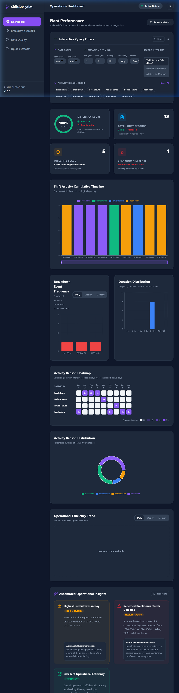
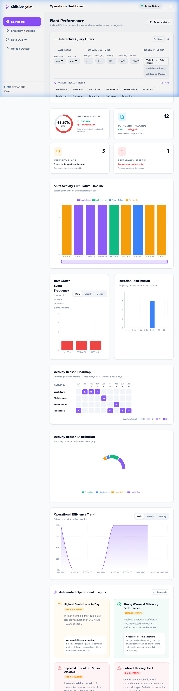
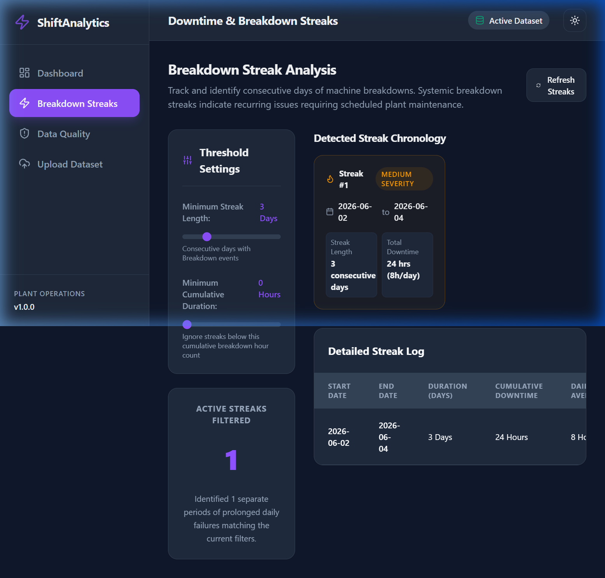
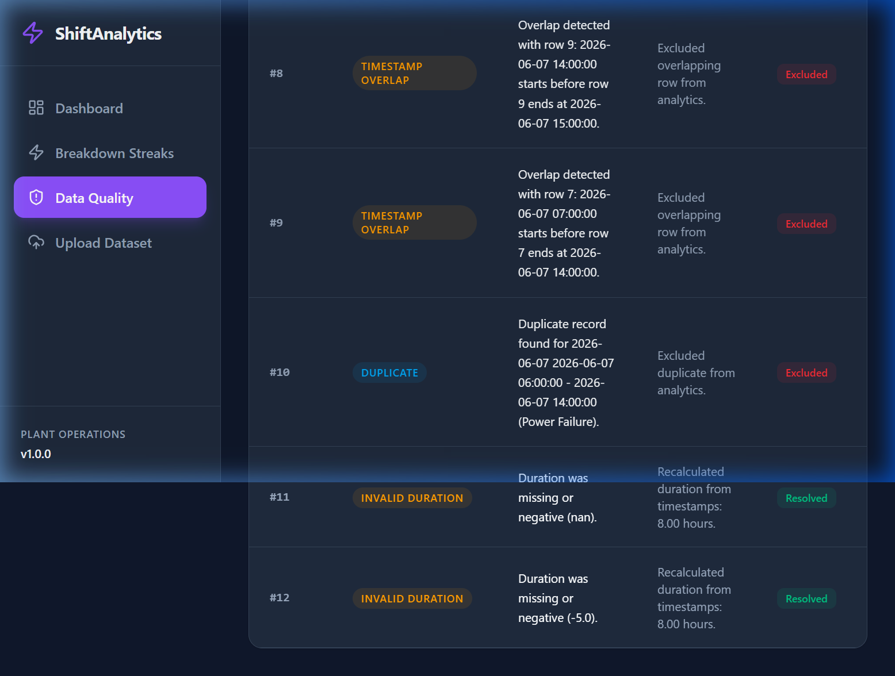
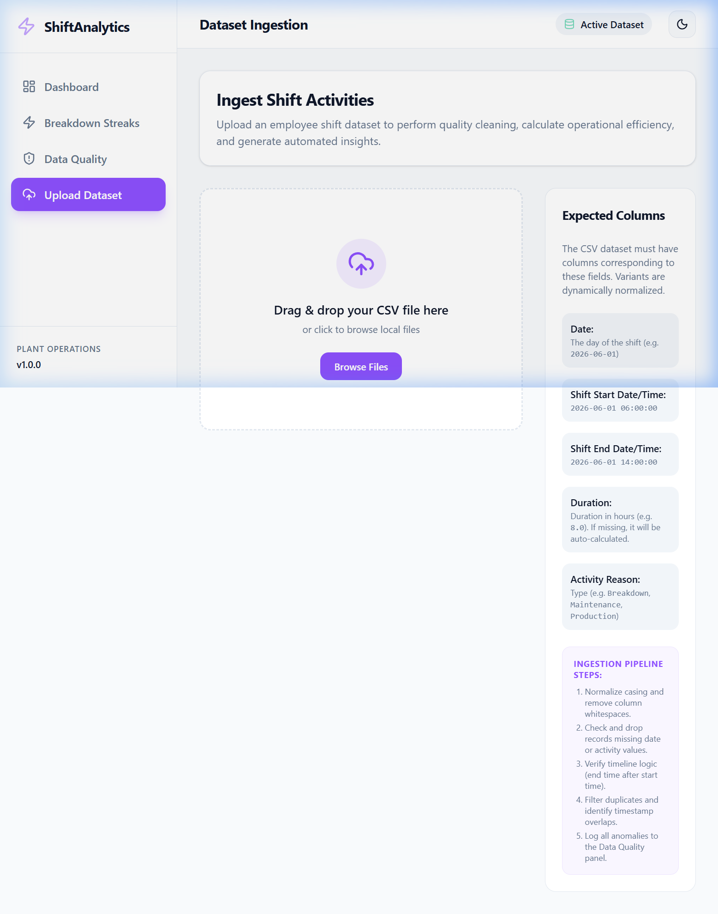

# Employee Shift Analytics Platform

A high-performance, full-stack analytics platform built to help operations teams and plant managers upload employee shift datasets, identify operational breakdown streaks, evaluate data quality inconsistencies, calculate overall operational efficiency, and generate actionable, data-driven recommendations.

---

## Key Features

* **Interactive Operations Dashboard**: High-fidelity visualizations of shift timelines, activity distributions, and hourly operational patterns.
* **Granular Filters**: Slice and dice datasets by date range, activity reason, shift duration, hour of day, weekday, month, and data validity.
* **Breakdown Streak Engine**: Configurable algorithm detecting consecutive breakdown periods, automatically classifying streak severity (Low, Medium, High).
* **Data Quality & Anomaly Log**: Instantly identifies duplicates, timestamp overlaps, missing critical values, and mismatched durations with auto-calculated recommendations.
* **Automatic Actionable Insights**: Data-driven, rule-based reasoning engine pointing out critical issues (e.g. night-shift equipment wear, weekend efficiency dips).
* **Premium Design System**: Modern, responsive CSS variables, glassmorphism layout, and robust dark/light themes.
* **Production-Ready Dockerization**: Standard configurations with PostgreSQL database orchestration.

---

## Application Screenshots

Here are some screenshots showcasing the platform's interfaces and visual features:

### 1. Operations Analytics Dashboard (Light Theme)
Interactive KPIs, circular gauges, breakdown frequency charts, timeline distribution, and auto-generated data insights.


### 2. Operations Analytics Dashboard (Dark Theme)
Premium dark mode interface with matching styles, charts, and colors.


### 3. Breakdown Streaks Detection
Calculates consecutive breakdown occurrences and classifies them by duration and length severity.


### 4. Data Quality & Anomaly Log
Logs missing fields, invalid durations, duplicates, and timestamp overlaps with suggested fixes.


### 5. Interactive CSV Ingestion Dropzone
Enables plant managers to upload datasets with safety confirmation warnings.


---

## System Architecture

The platform follows a clean, decoupling architecture separating the React client from the Django service layers:

```
                  +-----------------------------------+
                  |           React Frontend          |
                  |  (Vite + TS + Tailwind v4 + Recharts) |
                  +-----------------+-----------------+
                                    |
                                    | HTTP JSON REST
                                    v
                  +-----------------+-----------------+
                  |      Django REST Framework        |
                  |     - view-level serializers      |
                  |     - URL routers                 |
                  +-----------------+-----------------+
                                    |
                  +-----------------v-----------------+
                  |        Service Layer (ETL)        |
                  |  - CSVProcessor & Cleaner (Pandas)|
                  |  - StreakService (Consecutiveness) |
                  |  - EfficiencyService (Agnostic)   |
                  |  - InsightEngine (Rule-based)     |
                  +-----------------+-----------------+
                                    |
                                    v
                           +--------+--------+
                           |  PostgreSQL /   |
                           |  SQLite Database|
                           +-----------------+
```

---

## Technology Stack

### Frontend
* **Core**: React 19, TypeScript, Vite 8, React Router v7
* **State Management**: TanStack Query / React Query v5 (Server State), React Context (Theme / Global State)
* **Styling**: Tailwind CSS v4
* **Charts**: Recharts (Responsive Line, Bar, Area, Pie/Donut, Heatmap, Timeline)
* **API Client**: Axios

### Backend
* **Web Framework**: Django 5.2, Django REST Framework 3.15
* **Data Processing**: Pandas, NumPy
* **Database**: PostgreSQL (Dockerized) / SQLite (Local Development default)
* **Testing**: Python TestCase, pytest

---

## Local Setup & Installation

### Prerequisites
* Node.js v20+
* Python 3.11+
* Docker & Docker Compose (optional, for PG setup)

### Option A: Running with Docker Compose (Recommended)

To stand up the database, backend services, and frontend bundle with one command:

```bash
docker-compose up --build
```
* **Frontend**: Accessible at `http://localhost:3000/`
* **Backend API**: Accessible at `http://localhost:8000/api/`
* **PostgreSQL**: Bound to `localhost:5432`

---

### Option B: Manual Local Setup

#### 1. Backend Setup
Navigate to the `backend` directory:
```bash
cd backend
```

Create a virtual environment and activate it:
```bash
# Windows
python -m venv .venv
.venv\Scripts\activate

# macOS/Linux
python3 -m venv .venv
source .venv/bin/activate
```

Install dependencies:
```bash
pip install -r requirements.txt
```

Run database migrations:
```bash
python manage.py migrate
```

Start the Django development server:
```bash
python manage.py runserver
```
The backend API is running at `http://localhost:8000/`.

---

#### 2. Frontend Setup
Navigate to the `frontend` directory:
```bash
cd ../frontend
```

Install dependencies:
```bash
npm install
```

Start the Vite development server:
```bash
npm run dev
```
The frontend application is running at `http://localhost:5173/`.

---

## Running Tests

### Backend Unit Tests
To run Django backend tests:
```bash
cd backend
.venv\Scripts\activate
python manage.py test
```

### Frontend Linters
To run frontend lint check:
```bash
cd frontend
npm run lint
```

---

## API Documentation

The Django REST API exposes the following RESTful HTTP JSON endpoints:

| Endpoint | Method | Description |
|---|---|---|
| `/api/upload/` | `POST` | Uploads a CSV file, runs data cleaning, replaces existing records, returns processing stats. |
| `/api/dashboard/summary/` | `GET` | Returns summary metrics for KPI cards (operational efficiency, anomaly counts, streaks). |
| `/api/filters/` | `GET` | Returns metadata limits (min/max date, durations, distinct activity reasons) for filters. |
| `/api/activities/` | `GET` | Returns a list of shift records filtered by query parameters. |
| `/api/efficiency/` | `GET` | Returns overall operational efficiency score and chronological trends (daily/weekly/monthly). |
| `/api/streaks/` | `GET` | Detects consecutive days with breakdown activities matching a minimum streak length threshold. |
| `/api/insights/` | `GET` | Generates rule-based, data-driven insights and actionable equipment recommendations. |
| `/api/data-quality/` | `GET` | Returns an issue logs list with categories, descriptions, row index, and recommended fixes. |

---

## Data Quality Validations

Our robust cleaner checks each record against five categories of data inconsistencies:
1. **Missing Critical Values**: Missing Date or Activity Reason automatically excludes the row.
2. **Invalid Duration**: Duration <= 0 or duration that mismatched start/end timestamps is corrected using the timestamp difference.
3. **Timestamp Inversions**: End time before Start time is flagged and excluded from active analytics.
4. **Duplicate Records**: Multiple identical rows (date, start time, end time, reason) are identified and de-duplicated.
5. **Overlapping Shifts**: Active shift periods that overlap are flagged to prevent inflated duration calculations.
